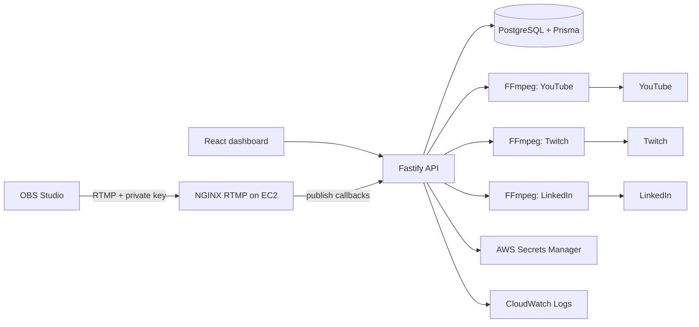

# Cloud Restreamer Prototype

A working college prototype for sending one OBS RTMP feed into a cloud server and forwarding it independently to YouTube, Twitch, and LinkedIn.



## What is included

- React + Vite + TypeScript dashboard with `/login`, `/dashboard`, `/streams/new`, and `/streams/:id` views.
- Fastify API with secure random one-time-visible stream keys (only SHA-256 hashes go to PostgreSQL).
- PostgreSQL/Prisma models for users, streams, destinations, sessions, and events.
- NGINX RTMP ingest. Its publish callback verifies the submitted OBS key before accepting it.
- One FFmpeg stream-copy process per destination. A failing platform is retried after 2, 5, and 10 seconds without stopping the others.
- Docker Compose stack, AWS bootstrap, CloudWatch log configuration, test plan, and an EC2 deployment guide.

## Prerequisites

Install/verify the tools listed in [environment.md](docs/environment.md): Docker Desktop, Docker Compose, Node 22 LTS, npm, FFmpeg, AWS CLI, Git, and OBS. The current scan found Git and OBS; the remaining CLI tools are pending installation.

## Local setup

```powershell
Copy-Item .env.example .env
# Edit .env: use a strong POSTGRES_PASSWORD and set local destination URLs only for testing.
docker compose up --build -d
Invoke-RestMethod http://localhost:3001/health
```

Open `http://localhost:8080`. Create a stream, copy its stream key, and select **Arm for OBS**. In OBS configure:

```text
Service: Custom
Server: rtmp://localhost/live
Stream key: <one-time key supplied by the dashboard>
```

For a no-camera local ingest check, run `streaming/scripts/send-test-stream.sh` from a POSIX shell or adapt its FFmpeg command for PowerShell.

## Destination configuration

Do not paste platform keys into the API or repository. For AWS, create one Secrets Manager secret per platform containing the **complete RTMP destination URL**, then enter its secret ARN/name in the dashboard and enable that route.

For a local-only test, `YOUTUBE_RTMP_URL`, `TWITCH_RTMP_URL`, and `LINKEDIN_RTMP_URL` can be set in `.env`. They are never returned by the API. Do not use local plaintext values for EC2 deployment.

## API

| Method | Route | Purpose |
| --- | --- | --- |
| `GET` | `/health` | Service health |
| `POST` | `/api/streams` | Create a stream and return its one-time OBS key |
| `GET` | `/api/streams` | List streams |
| `GET` | `/api/streams/:id` | Stream plus safe destination statuses |
| `POST` | `/api/streams/:id/start` | Arm the stream for OBS |
| `POST` | `/api/streams/:id/stop` | Stop output processes and close the stream |
| `DELETE` | `/api/streams/:id` | Delete stream records |
| `GET` | `/api/streams/:id/status` | Polling status endpoint |
| `PUT` | `/api/streams/:id/destinations/:destinationId` | Enable a route and set its secret reference |

Example:

```powershell
$stream = Invoke-RestMethod http://localhost:3001/api/streams -Method Post -ContentType 'application/json' -Body '{"name":"College Event Demo"}'
$stream.ingest.server
$stream.ingest.streamKey # Save it now; GET endpoints deliberately never return it.
```

## AWS and final demonstration

Follow [aws-deployment.md](docs/aws-deployment.md), then execute the [test plan](docs/test-plan.md). The recommended live demonstration is: create `College Event Demo` → copy the dashboard endpoint into OBS → start OBS → show dashboard `LIVE` → show receiving platforms → show EC2 CloudWatch `NetworkIn`/`NetworkOut`.

## Security notes

- `.env`, platform keys, AWS credentials, and database passwords are ignored by Git.
- The frontend never receives destination credentials.
- Raw OBS stream keys are generated with `crypto.randomBytes(32)`, returned only on creation, and stored as hashes.
- API logs redact request bodies. FFmpeg stderr is intentionally not forwarded because destination URLs include platform stream keys.
- In EC2, keep ports 3001, 5432, and nginx status pages private.

## Current validation status

Node 22.23.3, npm 10.9.9, Git, Docker/Compose, FFmpeg/FFprobe 9.0.2, OBS 32.0.1, the API, PostgreSQL, dashboard, NGINX RTMP ingest, local restream sink, failure isolation, and reconnect flow were verified. OBS GUI and real external platforms were not automated; AWS CLI/EC2/Secrets Manager/CloudWatch remain untested. See [validation-report.md](docs/validation-report.md) for exact evidence.
